# Azure-Certification-DP-201: Designing an Azure Data Solution
Road to Azure Data Engineer Part-II

## Exam Pattern

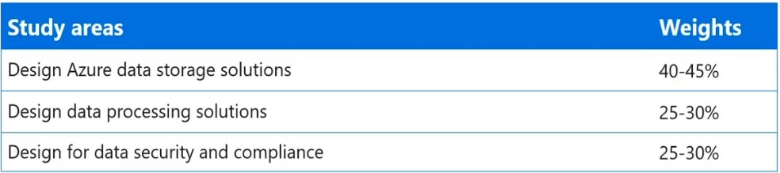

### 1. Design Azure Data Storage Solutions (40-45%)

- Recommend an Azure data storage solution based on requiremnets

  - choose the correct data storage solution to meet the technical and business requirements
  - choose the partition distribution type

- Design non-relational cloud data stores

  - design data distribution and partitions
  - design for scale (including multi-region, latency, and throughput)
  - design a solution that uses CosDB, Data Lake Storage Gen2, or Blob storage
  - select the appropriate Cosmos DB API
  - design a disaster recovery strategy
  - design for high availability

- Design relational cloud data stores

  - design data distribution and partitions
  - design for scale (including multi-region, latency,throughput)
  - design a solution that uses SQL Database and Azure Synapse Analytics
  - design a disaster recovery strategy
  - design for high availability

### 2. Design Data Processing Solutions (25-30%)

- Design batch processing solutions

  - design batch processing solutions that use Data Factory and Azure Databricks.
  - identify the optimal data ingestion method for a batch processing solution
  - identify where processing should take place, such as at the source, at the destination, or in transit
  - identify transformation logic to be used in the Mapping Data Flow in Azure Data Factory

- Design real-time processing solutions

  - Design for real-time processing by using Stream Analytics and Azure Databricks
  - design and provision compute resources

### 3. Design for Data Security and Compliance (25-30%)

- Design security for source data access

  - plan for secure endpoints (private/public)
  - choose the appropriate authentication mechanism, such as access keys, shared access signatures (SAS), and Azure Active Directory (Azure AD)

- Design security for data policies and standards

  - design data encryption for data at rest and in transit
  - design for data auditing and data masking
  - design for data privacy and data classification
  - design a data retention policy
  - plan an archiving strategy
  - plan to purge data based on business requirements

## 1. Design Azure Data Storage Solutions

## Azure Storage

### BLOB

- It is also a backbone for creating a storage account that can be used as a Data Lake storage

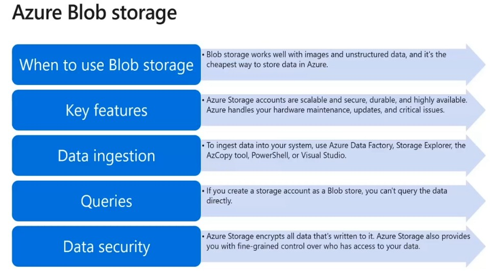

### CosmosDB

- Globally distributed and elstically scalable database.

#### i) Core (SQL) API

- Default API for Azure Cosmos DB
- Can query heirarchical JSON documents with a SQL-like language
- Uses Javascript's type system, expression evaluation, and function invocation.

#### ii) MongoDB API

- Allows existing MongoDB client SDKs, drivers, and tools to interact with the data transparently, as if they are running against an actual MongoDB database.
- Data is stored in document format, similar to Core (SQL)

#### iii) Cassandra API

- Using Cassandra Query language (CQL), the data will appear to be a partitioned row store.

#### iv) Table API

- The original table API only allows for indexing on the partition and row keys; there are no secondary indexes.
- Storing table data in Cosmos DB automatically indexes all the properties, requires no index management.
- Querying is accomplished by using OData and LINQ queries in code, and the original REST API for GET operations.

#### v) Gremlin API

- Provides a graph based view over the data. Remember that at the lowest level, all data in any Azure Cosmos DB is stored in an ARS format.
- Use a traversal language to query a graph database, and Azure Cosmos DB supports Apache Tinkepop's Gremlin language.

## Analyze the storage decision criteria

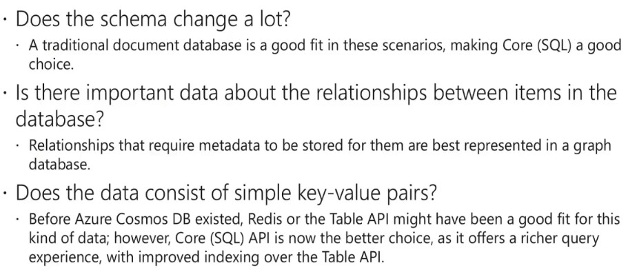

## Scenario's to choose different CosmosDB API's

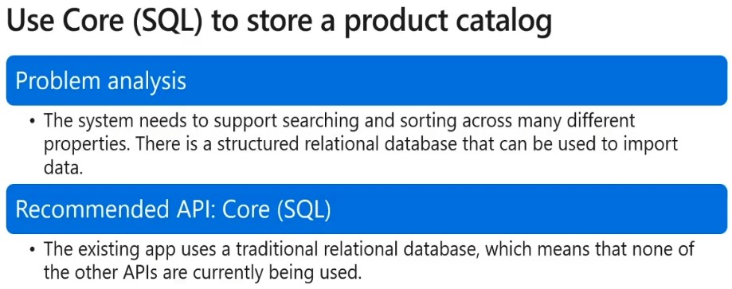

----

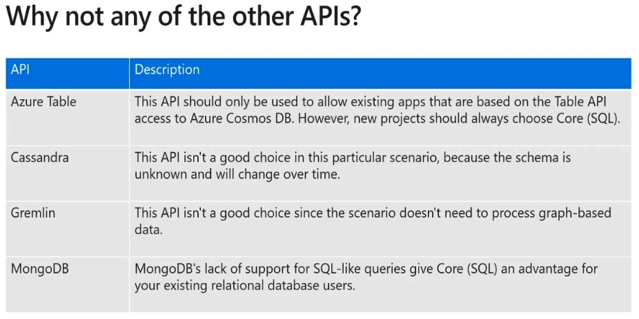

------------------------------------------------------------------------

------------------------------------------------------------------------

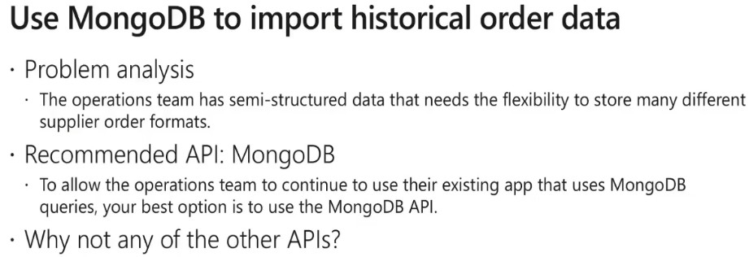

    - We are not looking into any relationships so Gremlin is not the right choice
    - Other CosmosDB API's are not used since the existing queries are MongoDB native and there MongoDB is the best fit

------------------------------------------------------------------------

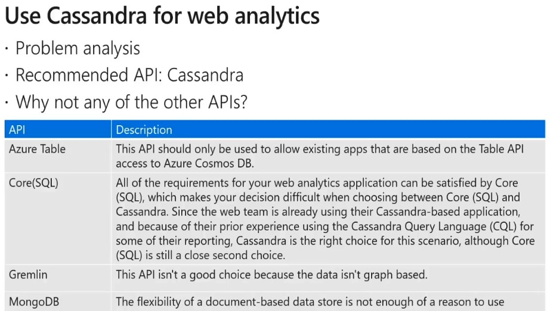

------------------------------------------------------------------------

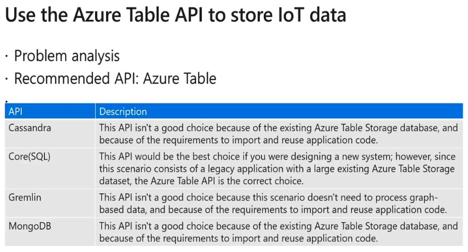

------------------------------------------------------------------------

## Request Unit Considerations for CosmosDB

- Item size
- Item indexing
- Item property count
- Indexed properties
- Data consistency
- Query patterns
- Script usage

## CosmosDB Partition Design

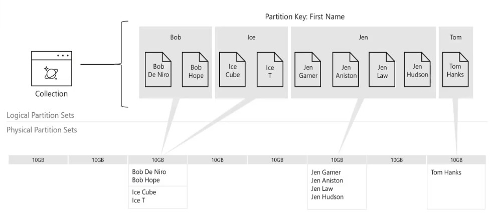

- Items are placed into logical partitions by partition key
- Partition keys should generally be based on unique values
- Ideally the partition key should be part of a query to prevent "fan out"
- Logical partitions are mapped to physiccal partitions
- A physical partition always contains atleast one logical partition
- Physical partitions are capped at 10GB
- As physical partitions fill-up they will seamlessly split
- Logical partitions can not be split

------------------------------------------------------------------------

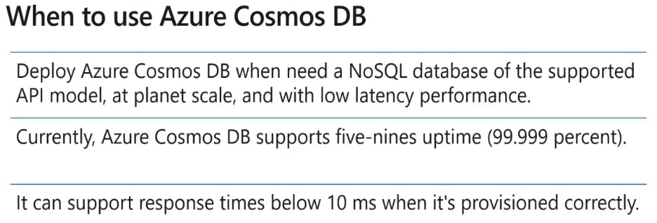

------------------------------------------------------------------------

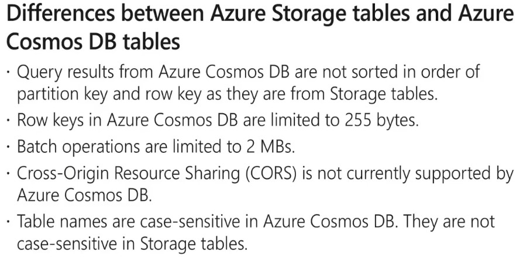

------------------------------------------------------------------------

------------------------------------------------------------------------

## Azure SQL Database hosting options

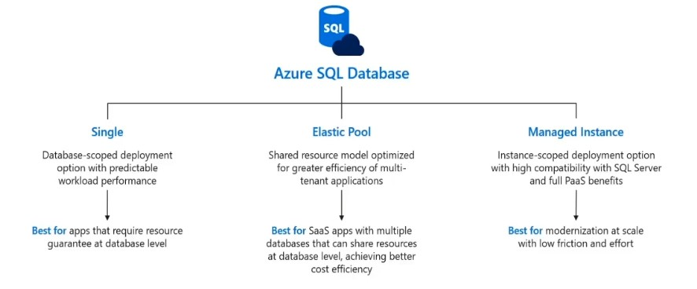

------------------------------------------------------------------------

## SQL Security

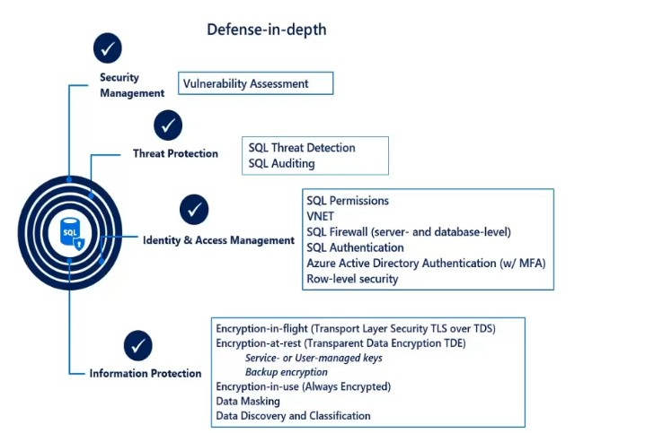

------------------------------------------------------------------------

## Scenario to choose Azure SQL

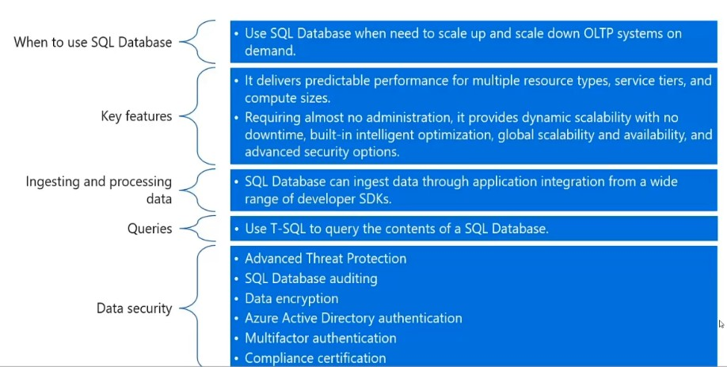

------------------------------------------------------------------------

## Scenario to choose Azure Synapse

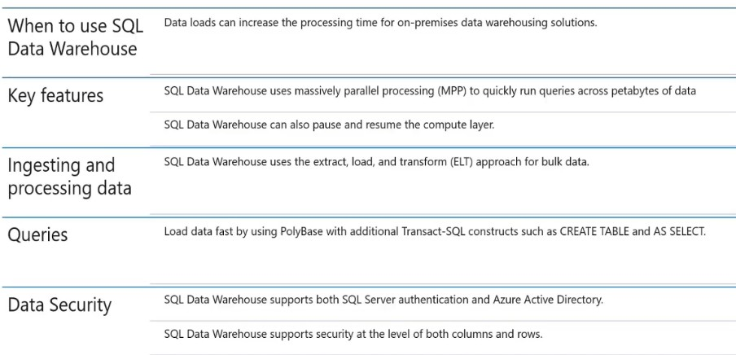

------------------------------------------------------------------------

## Scenario to choose Azure Data Lake Storage Gen2

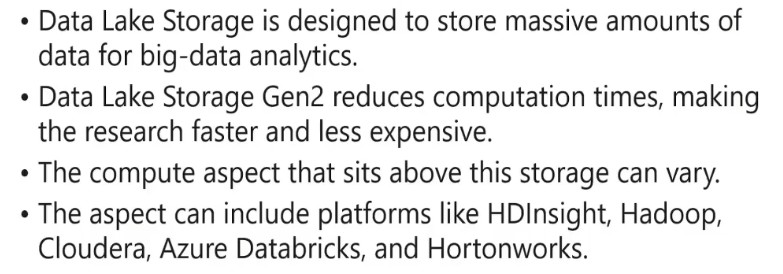

------------------------------------------------------------------------

## Azure Stream Analytics

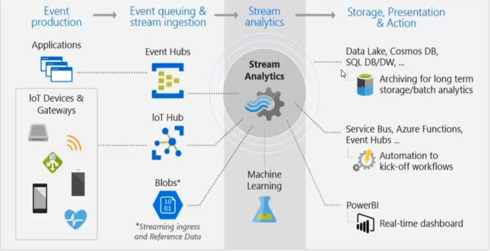

------------------------------------------------------------------------

## Scenario to choose Stream Analytics

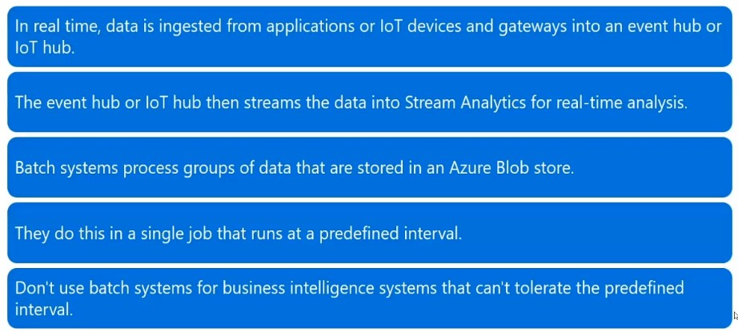

## 2. Design Data Processing Solutions

### Components of Big Data architecture

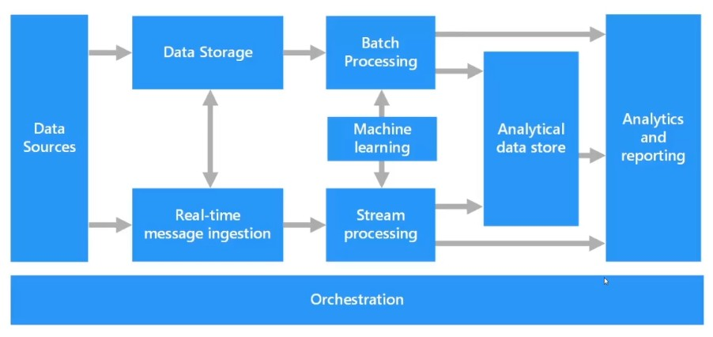

### Lambda Architecture

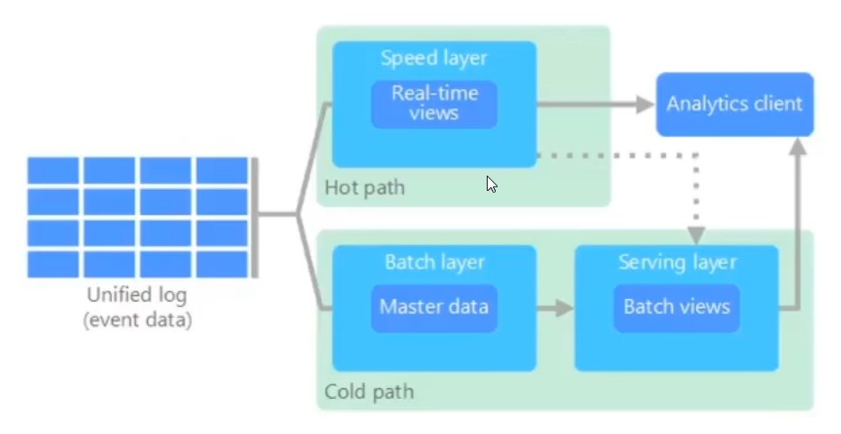

- When working with very large data sets, it can take a long time to run the sort of queries that clients need.
- Often require algorithms such as Spark/ Mapreduce that operate in parallel across the entire data set.
- The results are then stored seperately from the raw data and used for querying.
- Drawback to this approach is that it intoduces latency

The lambda architecture, addresses this problem by creating two paths for data flow:
- Batch layer (cold path)
- Speed layer (hot path)

### Kappa Architecture

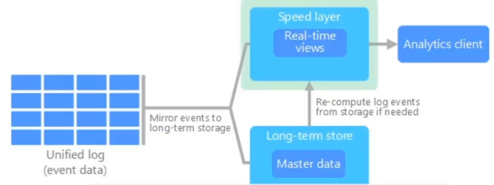

- A drawback to the lambda architecture is its complexity.
- Processign logic appears in two different places - the cold and hot paths - using different frameworks
- This leads to duplicate computation logic and the complexity of managing the architecture for both paths.
- The kappa architecture was proposed by Jay Kreps as an alternative to the lambda architecture.
- All data flows through a single path, using a stream processing system.

### IOT

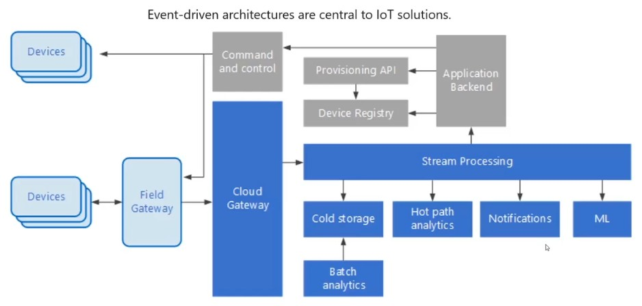

### Batch Processing

### Scenario's to use Batch Processing

- From simple data transformations to a more complete ETL (extract-transform-load) pipeline
- In a big data context, batch processing may operate over very large data sets, where the computation takes significant time.
- One example of batch processing is transforming a large set of flat, semi-structured CSV or JSON files into a schematized and structured format that is ready for further querying.

### Design considerations for Batch processing

- Data format and encoding
    - When files use an unexpected format or encoding
      - Example is text fields that contain tabs, spaces, or commas that are interpreted as delimeters
    - Data loading and parsing logic must be flexible enough to detect and handle these issues.
    
- Orchestrating time slices
    - Often source data is placed in a folder hierarchy that reflects processsing windows, organized by year, month, day, hour, and so on.
    - Can the downstream processing logic handle out-of-order records?

### Batch processing Logical components

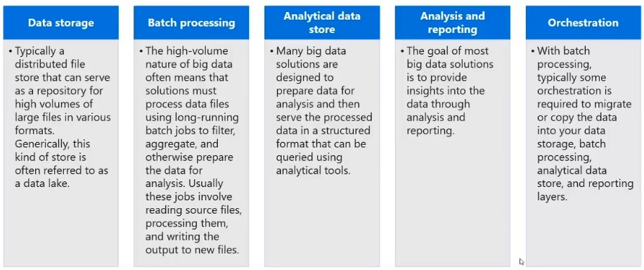

### Batch processing Techmology choices

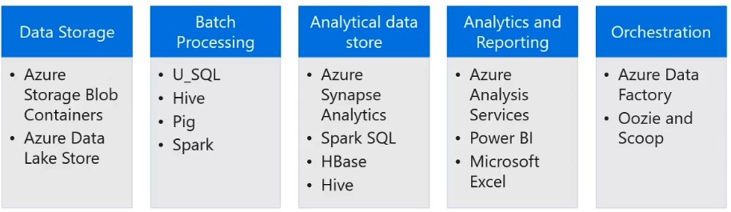

### Batch processing with Azure Databricks

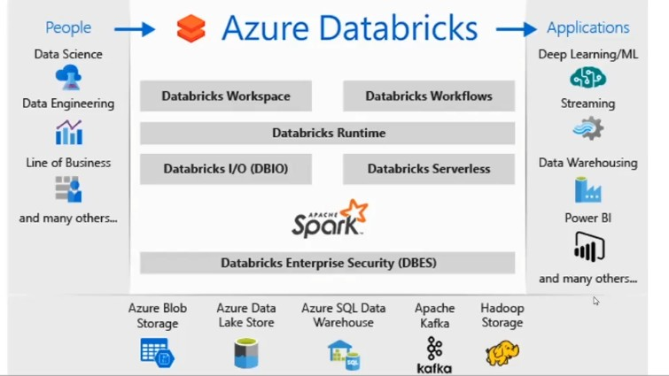

- Fast cluster start times, autotermination, autoscaling
- Built-in integration with Azure Blob Storage, ADLS, Azure Synapse, and other services.
- User authentication with Azure Active Directory.
- Web-based notebooks for collaboration and data exploration.
- Supports GPU-rnabled clusters.

### Usage of Azure Databricks

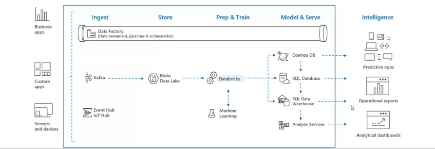

-  To read data from multiple data sources such as Azure Blob Storage, ADLS, Azure Cosmos DB, or SQL DW and turn it into breakthrough insights using spark.

### Azure Machine Learning

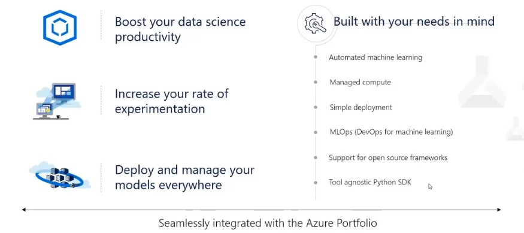

### Machine Learning Typical E2E process

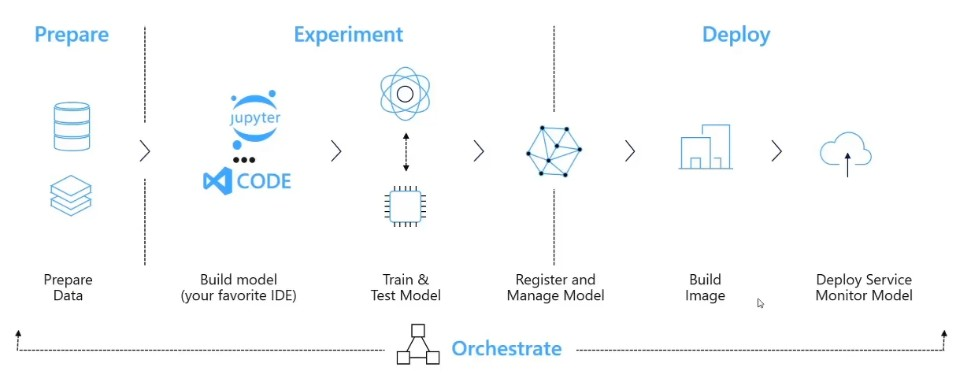

### Devops Loop for Data Science

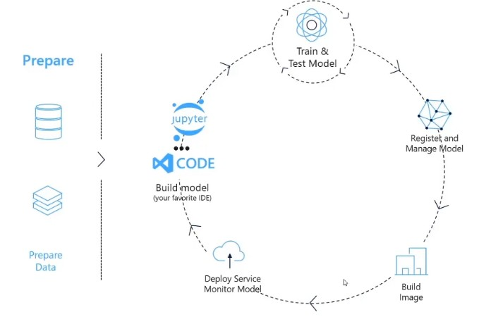

### Azure Databricks + Azure ML

- Log experiments and models in a central place
- Maintain audit trails centrally
- Deploy models seamlessly in Azure ML
- Manage your models in Azure ML

### Standardizing the ML lifecycle on Azure Databricks

### Realtime Processing

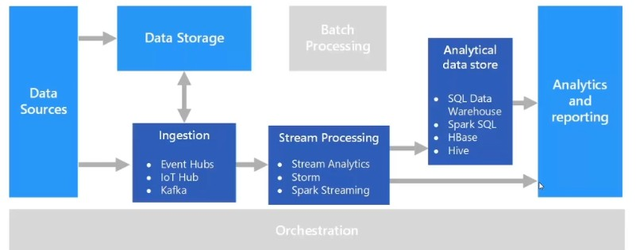

### Challenges

- One of the big challenges of real-time processing solutions is to ingest, process, and store messages in real time, especially at high volumes.
- Procesing must be done in such a way that it does not block the ingestion pipeline.
- The data store must support high-volume writes.
- Another challenge is to act on data quickly such as generating alerts in real time or presenting the data in a real-time (or near real-time) dashboard.

### Real Time Processing Architecture - Logical COmponents

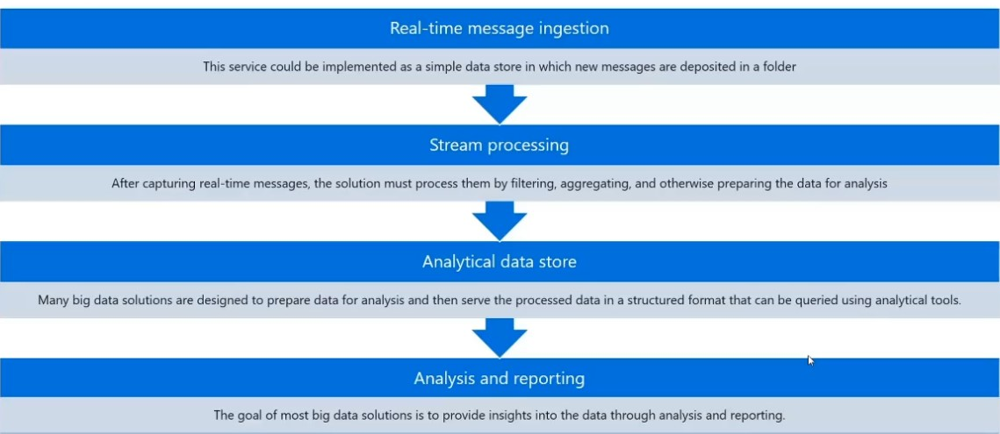

### Real Time Processing Techonolgy choices

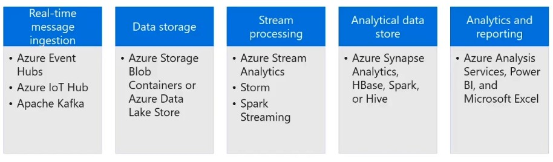

### Azure Data Factory (ADF)

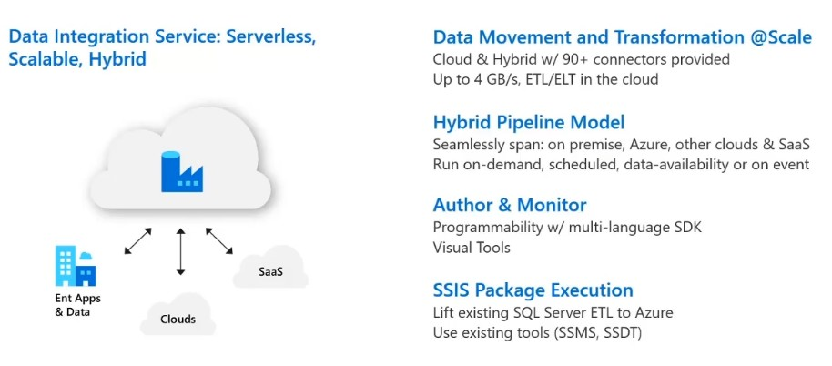

A cloud-based data integration service that allows you to orchestrate and automate data movement and data transformation.
- Connect & collect
- Transform and enrich

### ADF Components

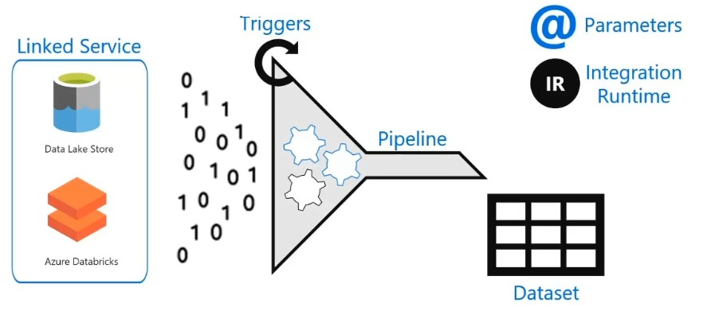

### Data Transformation in Azure

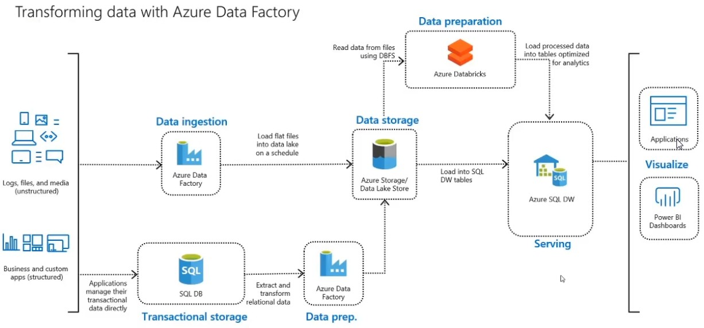

### Scenario to use ADF

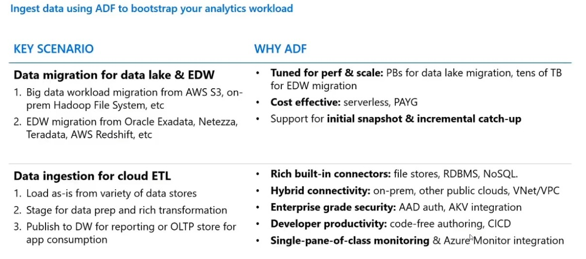

### Real Time Analytics

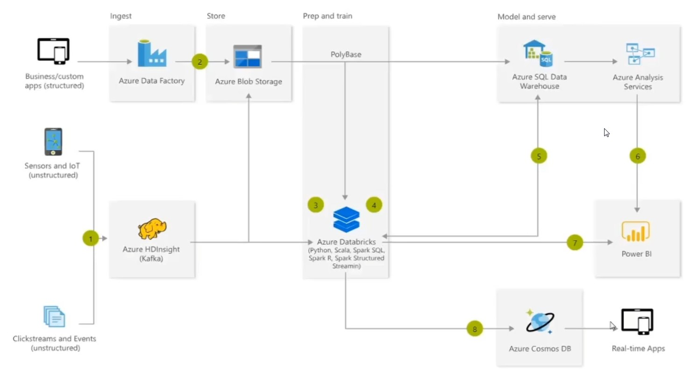

### Complexities in Stream Processing

- Complex Data
    - Diverse data formats (json, avro, binary, ...)
    - Data can be dirty, latem out of order
    
- Complwx Workloads
    - Combining Streaming with interactive queries
    - Machine learning
    
## 3. Design for Data Security and Compliance

### Securing Azure Storage

- Azure services such as Blob storage, Files share, Table storage, and Data Lake Store all build on Azure Storage.
- High-level security benefits for the data in the cloud:
    - Protect the data at rest
        - That is encrypt the data before persisting it into the storage and decrypt while retrieving. eg: Blob, Queue
    - Protect the data in transit
    - Support browser cross-domain access
    - Control who can access data
    - Audit storage class

#### Encryption at rest - Azure Storage Service Encryption (SSE)

- All storage data encrypted at rest - protected from physical breach
    - By default, one master key per account, managed by Microsoft
    - Optionally, protect the master key with your own key in Azure Key Vault
    - Each write encrypted with a unique derived key

- All data writtern to storage is encrypted with SSE i.e, 256 bit advanced standard AES cipher. SSE automatically encrypts data on writting to Azure storage. This feature cannot be disabled

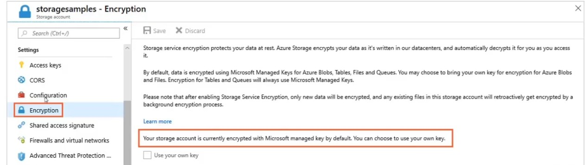

- For VM's Azure lets you encrypt virtual hard-disks by using Azure disk encryption. This encryption uses bitlocker for windows images and uses DEM encrypt for linux.

- Azure key Vault stores the keys automatically to help you contaol and manage disk encryption, keys and secret automatically.

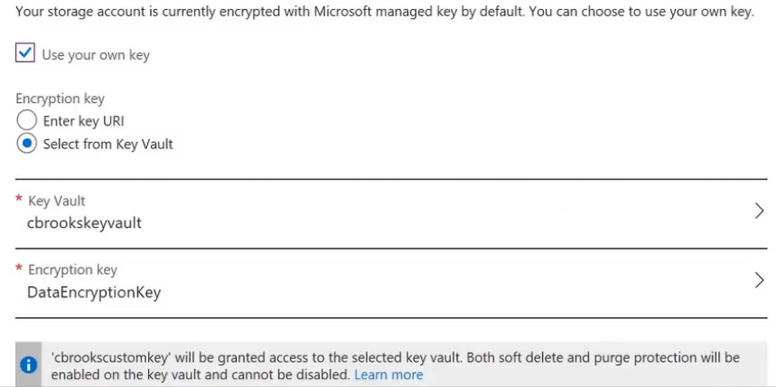

---------------

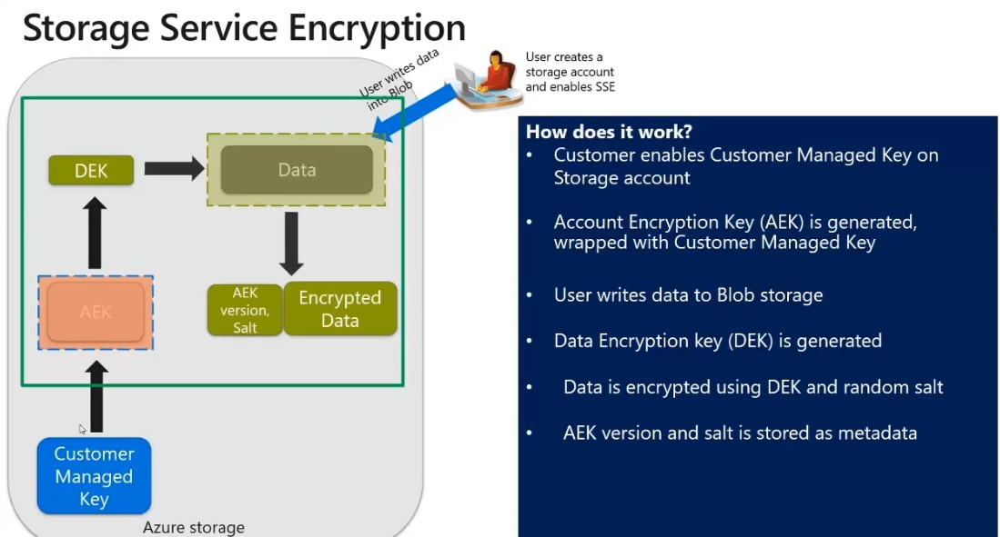

#### Encryption at rest models

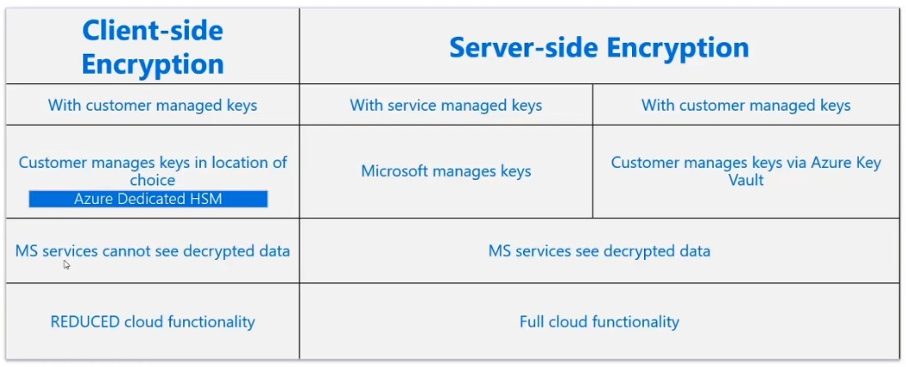

#### Azure Key-Vault

- Safeguard cryptogrpahic keys and other secrets used by cloud apps and services.

#### Encryption in transit

- Keep your data secure by enabling transport-level security between Azure and the client.
- Always use HTTPS to secure communication over the public internet.
- When you call the REST APIs to access objects in storage accounts, you can enforce the use of HTTPS by requiring secure transfer for the storage account.

#### Cross Origin Resource Sharing (CORS) support

- Azure Storage supports cross-domain access through cross-origin resource sharing (CORS)
- It is a optional flag that can be applied on storage accounts. The flag adds appropriate headers when you use http requests to retirve resources from storage account.
- It uses HTTP headers so that a web application at one domain can access resources from a server at a different domain.
- By using CORS, web apps ensure that they load only authorizes content from authorized sources.

#### Identity-Based Access Control for Azure Blob Storage

##### Grant access to user and service identities from Azure Active Directory

- Federate with enterprise identity systems
- Leverage powerful AAD capabilities including 2-factor and biometric authentication, conditional access, identity protection and more.

##### Control access with role-based access control (RBAC)

- Grant access to storage scopes ranging from entire enterprise down to one blob container
- Define custom roles that match your security model
- Leverage Privileged Identity Management to reduce standing administrative access.

AAD Authentication and RBAC currently support AAD, OAuth and RBAC on Storage Resource Provider via ARM.

#### Managed identities for Azure resources

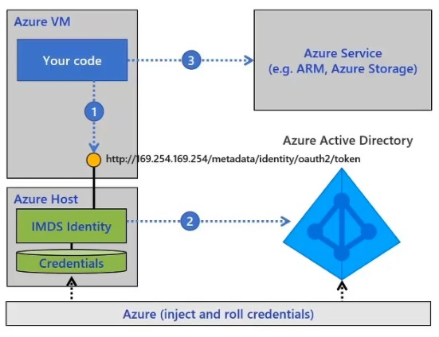

- Auto-managed identity in Azure AD for Azure resource.
- Use the MSI endpoint to get access tokens from Azure AD (no secretes required).
- Direct authentication with services, or retrieve creds from Azure key vault
- No additional charge for MSI.

#### Managed Shared Access Policies and Signatures

Storage Explorer provides the ability to manage access policies for containers.

- A shared access signature (SAS) provides you with a way to grant limited access to other clients, without exposing your account key.
- Provides delegated access to resources in your storage account.

##### Types of Shared Access Signature (SAS)

- Service level
  - Service level SAS are defined on a resource under a particular service.
  - Used to allow access to specific resources in a storage account.
  - For example, to allow an app tp retrieve a list of files in a file system or to download a file.
  
- Account level
  - Targets the storage account and can apply to multiple services and resources
  - For example, you can use an account-level SAS to allow the ability to create file systems.
  
#### Immutability Policies

- Support for time-based retention
    - container level configuration
    - RBAC support and policy auditing
    - BLobs cannot be modified or deleted for N days
    
- Support for legal holds with tags
    - Container level configuration
    - Blobs can not be modified or deleted when legal hold is set.
    
- Support for all Blob tiers
    - Applies to hot, cool and cold data
    - Policies retained when data is tiered
    
- SEC 17a-4(f) complaint

#### Firewall rules

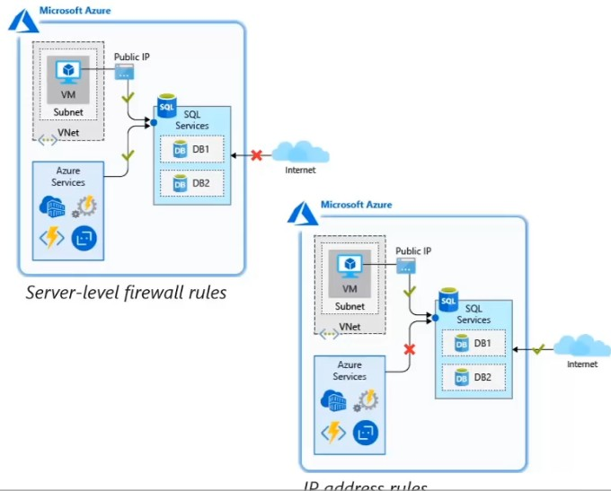

- Azure SQL DB has a built-in firewall that is used to allow and deny network access to both the db server itself, as well as individual db.
- Server-level firewall rules
    - Allow access to Azure services
    - IP address rules
    - Virtual network rules
- Database-level firewall rules
    - IP address rules

#### Firewalls and VNET access

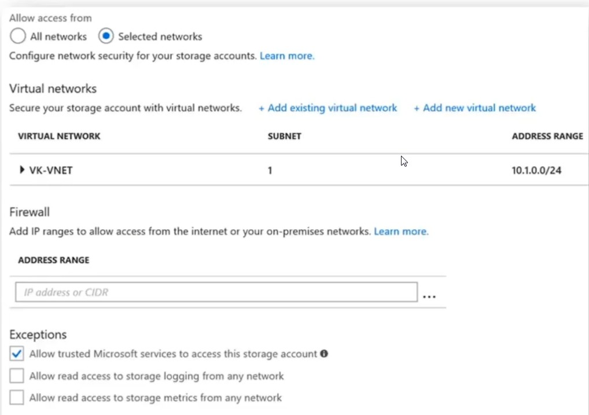

- Storage Firewall
    - Block internet access to data
    - Grant access to clients in specific vnet
    - Grant access to clients from on-premise networks via public peering network gateway

#### Private endpoints

- Azure private endpoint is a fundamental building block for private link in Azure. It enables service like Azure VM to communicate privately with private link resources.
- It is a network interwork interface that connects you privately and securely to service powered by Azure Private link.
- A private endpoint assigns a private IP address from your Azure Virtual Network (VNET) to the storage account.
- private endpoint enables communication from the same VNet, regionally peered VNets, globally peered VNets, and on-premises using VPN or Express Route, and services powered by private link.
- It secures all traffic between your VNet and the storage account over a private link.

#### Advanced threat protection for Azure Storage

- An additional layer of security intelligence that detects unusual and potentially harmful attempts to access or exploit storage accounts
- These security alerts are integrated with Azure Security Center.

#### Secure Azure Cosmos DB Data

- Using Firewal settings
- Add inbound and Outbound networks

#### Azure SQL database - Secure your data in transit, at rest and on display

- TLS network encryption
    - Azure SQL DB enforces Transport Layer Security (TLS) encryption at all times for all connections, which ensures all data is encrypted "in transit" between the database and the client.
- Transparent Data Encryption (TDE)
    - Protects your data at rest using TDE.
    - TDE performs real-time encryption and decryption of the DB, associated backups, and transaction log files at rest without requiring changes to the application.
- Dynamic data masking
    - By using the this, we can limit the data that is displayed to the user.
    - Policy-based security feature that hides the sensitive data in the result set of a query over designated DB fields, while the data in the DB is not changed e.g: phone numbers, credit card numbers.
    
#### Enable Database Auditing

- For SQL Serverm you can create audits tha contain specifications for server-level events and specifications for databse-level events.
- Audited events can be weitteb to the event logs or to audit files
- There are several levels of auditing for SQL Server, depending on government or standards requirements for your installation.
- Azure SQL DB and Azure Synapse Analytics auditing tracks database events and writes them to an audit log in your Azure storage account.
- Enable Threat detection to know any malicious activities on SQL DB or potential security threats.

#### Use an Azure SQL Database managed instance securely with public endpoints

- A SQL DB managed instance provides a private endpoint to allow connectivity from inside its VNET.

##### Scenarios where you need to provide public endpoint connection

- The managed instance must integrate with multi-tenant-only PaaS offerings.
-You need higher throughput of data exchange than is possible when you're using VPN.
- Company policies prohibit PaaS inside corporate networks.

##### Managed Instance - Lock down inbound and outbound connectivity

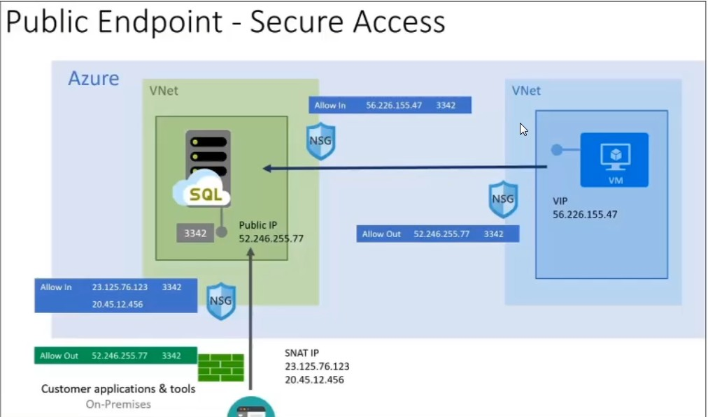

- A managed instance has a dedicated public endpoint address.
- In the client-side outbound firewall and in the NSG rules, set this public endpoint IP address to limit outbound connectivity.
- Use a NSG to limit access to the managed instance public endpoint on port 3342.

------------------------------------------------------------------------

# Tips to remember, A day prior to the Exam.

| Azure Service | Type of File |
| :---: | :---: |
| Azure CosmosDB | Graph Databases |
| Azure Hbase and HDInsight | Column Family in-memory key-value store |

| Azure Service | Usage |
| :---: | :---: |
| Azure Synapse | Data analytics |
| Azure Search | Search engine databases |
| Azure Timeseries Insights | Time series databases |
| Azure Blob | Object store |
| Azure FileStorage | Shared files |

### Azure CosmosDB Usage:

- For Real-Time Customer Experiences
- Telemetry stores for IOT
- Migrate NoSQL apps
